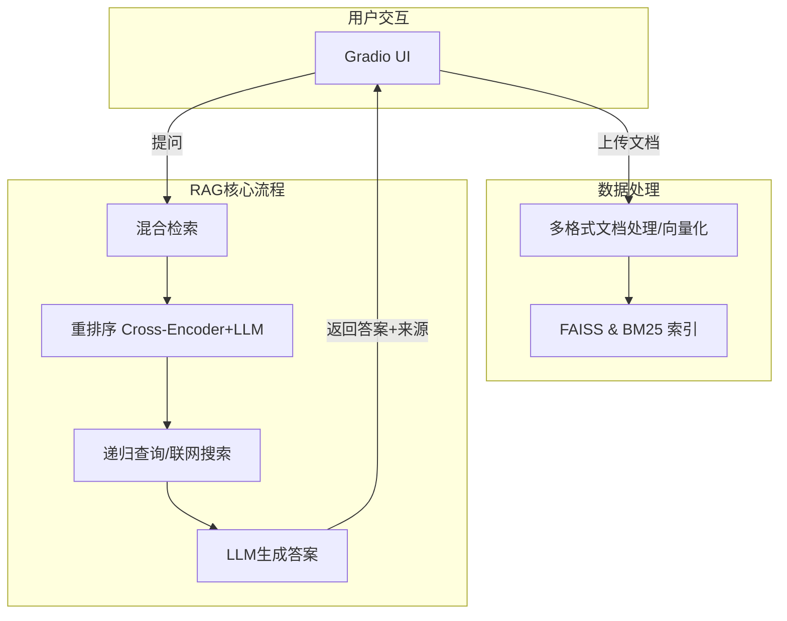

# 📚 本地化智能问答系统 (FAISS版)

一个帮助RAG入门者理解核心组件和流程的本地化智能问答项目。

## ✨ 功能亮点

本项目实现了一个功能完备且包含高级优化的RAG流程：

*   **多格式数据接入**：支持上传 `.pdf`, `.txt`, `.docx`, `.md`, `.html`, `.csv`, `.xls`, `.xlsx` 等多种格式的文档。
*   **高级检索策略**：
    *   **混合检索**：结合 **FAISS** (语义) 和 **BM25** (关键词) 提高召回率。
    *   **递归检索**：通过LLM自动生成子问题进行多轮查询，深挖答案。
    *   **智能索引**：根据文档数量自动选择最优的FAISS索引类型 (`IndexFlatL2`, `IndexIVFFlat`, `IndexIVFPQ`)，兼顾效率与精度。
*   **两阶段精准重排**：
    *   **第一阶段**：使用 `BAAI/bge-reranker-base` **Cross-Encoder** 模型进行高效初筛。
    *   **第二阶段 (可选)**：使用 `deepseek-r1:1.5b` **LLM** 进行最终的相关性判断。
*   **灵活的LLM后端**：
    *   **云端 (推荐)**：`deepseek-ai/DeepSeek-V3` (通过SiliconFlow API)。
    *   **本地**：`deepseek-r1:7b` (通过Ollama)。
*   **联网搜索增强**：可选配 **SerpAPI** 进行实时网络搜索，弥补离线知识的不足。
*   **用户友好的体验**：
    *   基于 **Gradio** 的交互式Web界面，支持**明暗主题切换**。
    *   答案附带**来源标注**，方便溯源。
    *   直观的**分块可视化**，支持查看每个文本块的详细内容。

## 🚀 快速开始

1.  **环境准备**
    ```bash
    # 安装依赖
    pip install -r requirements.txt

    # (可选) 准备本地大模型
    # 需先安装 Ollama: https://ollama.com/download
    ollama pull deepseek-coder:1.3b-base
    ```

2.  **配置 (可选)**
    在项目根目录创建 `.env` 文件，按需填入API密钥：
    ```env
    # 用于联网搜索
    SERPAPI_KEY="您的SERPAPI密钥"
    # 用于SiliconFlow云端大模型
    SILICONFLOW_API_KEY="您的SiliconFlow API密钥"
    ```

3.  **启动应用**
    ```bash
    python rag_demo_pro.py
    ```
    服务启动后，访问 `http://127.0.0.1:17995` (或终端提示的地址) 即可开始使用。

## 🔧 系统架构



## 💡 核心依赖与模型

*   **UI**: `gradio`
*   **Embedding模型**: `BAAI/bge-base-zh-v1.5`
*   **Reranker模型**: `BAAI/bge-reranker-base`
*   **LLM**: `requests` (用于Ollama/SiliconFlow API)
*   **数据处理**: `pdfminer.six`, `python-docx`, `beautifulsoup4`, `pandas`, `openpyxl`, `jieba`
*   **检索**: `faiss-cpu`, `rank_bm25`